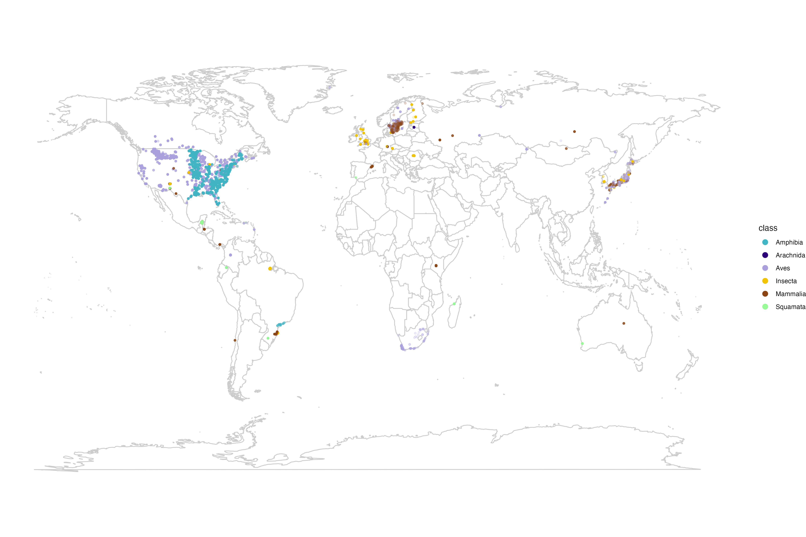

```{r setup, include=FALSE}
knitr::opts_chunk$set(echo = FALSE, warning = FALSE, message = FALSE)
```

<!-- Edit README.Rmd and run rmarkdown::render("README.Rmd") to update README.md. -->

# Reliability of ecological population time series

Code and supporting data for the manuscript **“Available time series provide low reliability in estimating population trends for terrestrial animals.”**

This repository quantifies uncertainty in population trend estimates and examines how monitoring duration, interannual variability, and temporal autocorrelation affect the reliability of ecological time series.

## Project overview

We assess whether statistical models can reliably recover population trends under different time-series conditions. The workflow combines:

- Empirical terrestrial animal abundance time series from BioTIME 2.0 (Dornelas et al., 2025).
- Simulated Poisson–lognormal population time series.
- Poisson mixed models with first-order autoregressive (AR1) temporal structure, fitted using `glmmTMB`.
- Reliability metrics: trend estimation error, bias, statistical power, false-positive rate, Type M error, and Type S error.

## Repository structure

```text
├── data/
│   ├── biotime_table.csv          # Fitted model estimates and diagnostics
│   ├── conversor.csv              # Model identifiers and spatial coordinates
│   └── data_filtered.csv          # Filtered annual abundance observations
├── scripts/
│   ├── 0_biotime_clean_data.R     # Clean and filter empirical data
│   ├── 1_analyse_biotime.R        # Fit models to empirical time series
│   ├── 2_create-simulation.R      # Simulate population time series
│   ├── 3_model-simulation.R       # Fit models to simulated time series
│   ├── 4_analysis-ms.R            # Calculate reliability metrics and figures
│   └── make_spatial_map.R         # Generate the interactive spatial map
├── docs/
│   └── spatial_map.html           # Generated interactive map (after running script)
├── LICENSE
├── README.Rmd                  # Editable documentation source
└── README.md                   # GitHub-rendered output
```

## Data description

The repository includes three complementary CSV files. The column names below match the supplied examples; descriptions of model parameters should be checked against the modelling scripts before publication.

### `data/conversor.csv`

Lookup table linking model identifiers to spatial coordinates. Coordinates are expressed in decimal degrees.

```{r metadata-conversor, echo=FALSE}
metadata <- as.data.frame(do.call(rbind, list(
    c("LATITUDE", "Latitude of the sampling location", "Decimal degrees"),
    c("LONGITUDE", "Longitude of the sampling location", "Decimal degrees"),
    c("model_id", "Unique identifier linking a time series to model outputs", "—")
)), stringsAsFactors = FALSE)
colnames(metadata) <- c("Name", "Description", "Unit")
knitr::kable(metadata, format = "pipe", align = c("l", "l", "l"))
```

### Models map




### `data/data_filtered.csv`

Filtered abundance observations used to fit empirical population models. Each row represents an annual observation for a modelled time series.

```{r metadata-data-filtered, echo=FALSE}
metadata <- as.data.frame(do.call(rbind, list(
    c("valid_name", "Standardized scientific name of the species", "—"),
    c("MODEL_ID", "Identifier of the modelled time series; corresponds to model_id in the other files", "—"),
    c("class", "Taxonomic class", "—"),
    c("STUDY_ID", "BioTIME study identifier", "—"),
    c("YEAR2", "Time index relative to the first observation (first year = 0)", "Years"),
    c("YEAR", "Calendar year of observation", "Year"),
    c("ABUNDANCE", "Recorded abundance for the species and time series", "Count / dataset-specific abundance unit"),
    c("group", "Group identifier used in the fitted model's random-effects structure", "—")
)), stringsAsFactors = FALSE)
colnames(metadata) <- c("Name", "Description", "Unit")
knitr::kable(metadata, format = "pipe", align = c("l", "l", "l"))
```

### `data/biotime_table.csv`

Summary of fitted models for empirical time series, including estimated population trends, interannual variability, temporal autocorrelation, fit statistics, and convergence diagnostics.

```{r metadata-biotime-table, echo=FALSE}
metadata <- as.data.frame(do.call(rbind, list(
    c("pod_id", "Processing batch identifier", "—"),
    c("loop_index", "Model index within the processing batch", "—"),
    c("class", "Taxonomic class", "—"),
    c("model_id", "Identifier of the modelled time series", "—"),
    c("species", "Scientific name of the species", "—"),
    c("n_years", "Number of observed years", "Years"),
    c("var", "Variance of observed abundance", "Abundance²"),
    c("mean", "Mean observed abundance", "Abundance"),
    c("min_year", "First observed year", "Year"),
    c("max_year", "Last observed year", "Year"),
    c("mu_zero_estimated", "Estimated model intercept", "Log scale"),
    c("mu_zero_estimated_se", "Standard error of estimated intercept", "Log scale"),
    c("mu_zero_estimated_pval", "P-value for estimated intercept", "—"),
    c("slope_estimated", "Estimated temporal slope on the model link scale", "Log scale/year"),
    c("slope_se", "Standard error of estimated slope", "Log scale/year"),
    c("r_estimated", "Estimated annual proportional population change", "Proportion/year"),
    c("r_estimated_lwr", "Lower confidence limit for annual proportional change", "Proportion/year"),
    c("r_estimated_upr", "Upper confidence limit for annual proportional change", "Proportion/year"),
    c("slope_pval", "P-value for the temporal slope", "—"),
    c("sdev_log_estimated", "Estimated log-scale variability parameter", "Model scale"),
    c("sdev_log_se_estimated", "Standard error of log-scale variability parameter", "Model scale"),
    c("sdev_estimated", "Estimated standard deviation of temporal random effects", "Log-abundance scale"),
    c("sdev_estimated_lwr", "Lower confidence limit for estimated standard deviation", "Log-abundance scale"),
    c("sdev_estimated_upr", "Upper confidence limit for estimated standard deviation", "Log-abundance scale"),
    c("phi_estimated", "Estimated AR1 temporal autocorrelation coefficient", "—"),
    c("phi_estimated_lwr", "Lower confidence limit for AR1 autocorrelation", "—"),
    c("phi_estimated_upr", "Upper confidence limit for AR1 autocorrelation", "—"),
    c("var_residuals_full", "Residual variance from the full fitted model", "Model-dependent"),
    c("var_residuals_fixed", "Residual variance associated with the fixed-effects-only prediction", "Model-dependent"),
    c("aic", "Akaike information criterion of fitted model", "—"),
    c("aic_null", "Akaike information criterion of null model", "—"),
    c("bic", "Bayesian information criterion of fitted model", "—"),
    c("bic_null", "Bayesian information criterion of null model", "—"),
    c("log_lik", "Log-likelihood of fitted model", "—"),
    c("log_lik_null", "Log-likelihood of null model", "—"),
    c("r2_conditional", "Conditional R², including fixed and random effects", "—"),
    c("r2_marginal", "Marginal R², for fixed effects", "—"),
    c("hessian_pos_def", "Whether the fitted model has a positive-definite Hessian", "Boolean"),
    c("convergence", "Reported optimizer convergence status", "Boolean"),
    c("message", "Optimizer diagnostic or convergence message", "—")
)), stringsAsFactors = FALSE)
colnames(metadata) <- c("Name", "Description", "Unit")
knitr::kable(metadata, format = "pipe", align = c("l", "l", "l"))
```

**Note:** `sdev_estimated_upr` may contain `Inf` and `phi_estimated_lwr` / `phi_estimated_upr` may contain missing values for poorly identified models. Do not interpret all reported parameter estimates as reliable without examining model diagnostics. The interpretations of `var_residuals_full`, `var_residuals_fixed`, and the variability parameterization should be verified against the extraction code.

## Script documentation

### `0_biotime_clean_data.R`

**Purpose:** Clean, filter, and prepare BioTIME data for modelling.

**Main steps:**

1. Load the raw BioTIME data and metadata.
2. Select terrestrial observations and the target animal taxa.
3. Standardize taxonomic classification using the GBIF backbone.
4. Group spatial sampling locations into plots within studies.
5. Apply quality filters, excluding time series that:
   - Contain fewer than three distinct years of observations.
   - Have missing years between their first and last observation (even if a shorter consecutive block exists).
   - Have fewer than two species detections.
   - Have a detection rate below 50%.
   - Contain only zero abundance values, according to the study-level filtering rule.

**Outputs:** `data_filtered.csv`, `conversor.csv`.

**Main dependencies:** `reshape2`, `dplyr`, `tidyr`, `ggplot2`, `data.table`, `terra`.

### `1_analyse_biotime.R`

**Purpose:** Fit Poisson mixed models with AR1 temporal correlation to empirical BioTIME time series.

```r
ABUNDANCE ~ YEAR2 + ar1(YEAR3 + 0 | group)
# family = poisson
```

The model includes a linear time effect and temporally correlated random effects. Extracted outputs include trend estimates, uncertainty intervals, interannual variability, autocorrelation, model fit statistics, and convergence diagnostics.

**Key functions:** `theta2phi()` converts the internal `glmmTMB` correlation parameter to an AR1 coefficient; `get_AR()` extracts estimated autocorrelation and confidence intervals.

**Execution:** Designed for parallel processing using the `POD_ID` environment variable.

**Outputs:** `Model_group_[pod_id].RData`.

**Main dependencies:** `dplyr`, `data.table`, `glmmTMB`.

### `2_create-simulation.R`

**Purpose:** Simulate Poisson–lognormal population time series across combinations of ecological parameters.

**Parameters described in the original documentation:**

- Trend (`r`): −0.25 to 0.25 in increments of 0.01.
- AR1 autocorrelation (`phi`): −0.9 to 0.9 in increments of 0.15.
- Interannual variability (`sdev`): 0 to 4, across 17 levels.
- Initial mean abundance (`mu_zero`): randomly sampled between 0.2 and 90.
- Maximum simulated duration: 100 years, with 100 replicates per parameter combination.

**Conceptual model:**

```text
mu[t] = mu[0] * (1 + r)^(t - 1) * exp(epsilon[t])
epsilon ~ MVN(0, Sigma)
y[t] ~ Poisson(mu[t])
```

`Sigma` encodes temporal variance and AR1 correlation. **Verify whether `sdev` is used as a variance or standard deviation in the simulation code before treating this equation as the exact implementation.**

**Outputs:** `simulated_data_[repi].RData`.

**Main dependencies:** `dplyr`, `mvtnorm`, `glmmTMB`, `MASS`, `data.table`.

### `3_model-simulation.R`

**Purpose:** Fit the empirical-model structure to simulated time series and compare estimates with known simulated parameters.

1. Load simulated data.
2. Truncate time series to the analysed durations (3–57 years).
3. Fit Poisson mixed models with AR1 temporal correlation.
4. Extract estimated trends, variability, autocorrelation, fit statistics, and convergence diagnostics.

**Outputs:** `[repi_i]_model.RData`.

**Main dependencies:** `glmmTMB`, `dplyr`, `data.table`.

### `4_analysis-ms.R`

**Purpose:** Summarize simulated model performance, estimate expected reliability for empirical time series, and produce figures.

1. Calculate reliability metrics from eligible simulated model fits: estimation error, bias, power to detect a 2% annual decline, false-positive rates, Type M error, and Type S error.
2. Summarize reliability across duration, interannual variability, and autocorrelation.
3. Match empirical time-series characteristics to the corresponding simulated reliability scenarios.
4. Generate manuscript figures and supplementary analyses.

**Outputs described in the original documentation:** `errors_simulations.csv`, `error_biotime_filtered.csv`, manuscript figures, and `tableS1.csv`.

**Main dependencies:** `glmmTMB`, `ggplot2`, `dplyr`, `cowplot`, `data.table`, `patchwork`, `scales`, `corrplot`, `tidyverse`.

## Data workflow

```text
Raw BioTIME data
    |
    v
0_biotime_clean_data.R
    |-- data_filtered.csv
    `-- conversor.csv --> make_spatial_map.R --> docs/spatial_map.html
    |
    v
1_analyse_biotime.R
    |
    v
biotime_table.csv

2_create-simulation.R
    |
    v
simulated_data_*.RData
    |
    v
3_model-simulation.R
    |
    v
*_model.RData
    |
    v
4_analysis-ms.R <-- empirical model results
    |
    v
Reliability summaries, tables, and figures
```

## Reliability metrics

| Metric | Interpretation |
|:---|:---|
| Estimation error | Root mean squared error of estimated population trends relative to their true values |
| Bias | Mean signed difference between estimated and true trends |
| Statistical power | Probability of detecting a statistically significant decline when a 2% annual decline is present |
| False-positive rate | Probability of detecting a significant trend when the true trend is zero |
| Type M error | Magnitude exaggeration factor among statistically significant trend estimates |
| Type S error | Probability of estimating the wrong trend direction among statistically significant estimates |

### Temporal autocorrelation

- `phi > 0`: positive temporal persistence.
- `phi = 0`: no first-order temporal autocorrelation.
- `phi < 0`: alternating temporal deviations.

### Interannual variability

Interannual variability is represented by log-scale random effects in the Poisson–lognormal process. When the parameter is the **log-scale variance** `sigma²`, the equivalent coefficient of variation is `sqrt(exp(sigma²) - 1)`. If the parameter is instead the **log-scale standard deviation** `sigma`, use `sqrt(exp(sigma^2) - 1)`.

## Software requirements

R (original documentation: version 4.0 or later). To render this R Markdown document, install `rmarkdown` and `knitr`. Main analysis packages include `glmmTMB`, `MASS`, `dplyr`, `data.table`, `tidyr`, `ggplot2`, `terra`, `cowplot`, `patchwork`, `scales`, `corrplot`, `leaflet`, and `htmlwidgets`.

## Running the analysis

### Sequential execution

```bash
Rscript scripts/0_biotime_clean_data.R
Rscript scripts/1_analyse_biotime.R
Rscript scripts/2_create-simulation.R
Rscript scripts/3_model-simulation.R
Rscript scripts/4_analysis-ms.R
```

### Parallel execution (HPC)

Scripts 1 and 3 use `POD_ID` to distribute processing across batches. For example:

```bash
for i in {0..99}; do
  POD_ID=$i Rscript scripts/1_analyse_biotime.R &
done
wait

for i in {0..99}; do
  POD_ID=$i Rscript scripts/3_model-simulation.R &
done
wait

Rscript scripts/4_analysis-ms.R
```

**Note:** Parallel execution of 100 R processes may exceed local resources. Use a scheduler or a smaller number of concurrent jobs where appropriate. Some scripts contain hard-coded working directories that must be adjusted to your environment.

## Notes and limitations

- The original BioTIME data can be obtained from [BioTIME](https://www.biotime.org/).
- Model convergence is not guaranteed for every simulated or empirical time series; examine both optimizer status and Hessian diagnostics.
- The simulation workflow is computationally intensive and is better suited to high-performance computing resources.
- The repository documents the available analysis workflow; confirm all numerical simulation settings against the final scripts.

## License

MIT License. See [LICENSE](LICENSE).

## References

Dornelas, M., et al. (2025). BioTIME 2.0: Expanding and improving a database of biodiversity time series. *Global Ecology and Biogeography*, *34*(5), e70003. https://doi.org/10.1111/geb.70003

- [BioTIME database](https://www.biotime.org/)
- [`glmmTMB` documentation](https://cran.r-project.org/package=glmmTMB)

## Updating the README

Edit `README.Rmd` and render it from the repository root:

```{r render-readme, eval=FALSE}
install.packages(c("rmarkdown", "knitr"))  # Only if needed
rmarkdown::render("README.Rmd")
```

The generated `README.md` is the version displayed by GitHub. The interactive Leaflet map is a separate HTML document; its link becomes functional after the map has been generated and published. The metadata tables above are based on the column names and examples supplied for the three datasets, not on an automated inspection of the complete CSV files.
